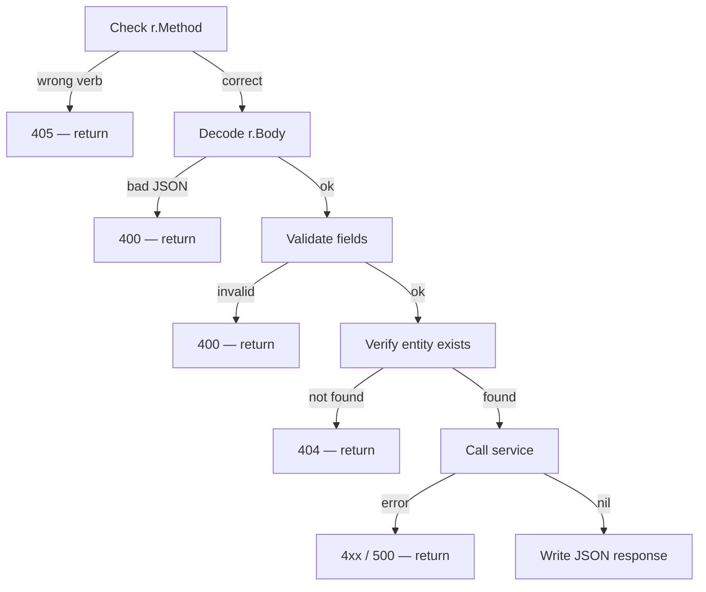

# How `net/http` Works in Go

A complete reference covering server setup, routing, middleware, request handling, and JSON encoding.

---

## Table of Contents

1. [Server Setup](#1-server-setup)
2. [Routing with ServeMux](#2-routing-with-servemux)
3. [Structuring a Server with Dependencies](#3-structuring-a-server-with-dependencies)
4. [Middleware](#4-middleware)
5. [Inside `*http.Request`](#5-inside-httprequest)
6. [Handler Flow](#6-handler-flow)
7. [Writing Responses with `http.ResponseWriter`](#7-writing-responses-with-httpresponsewriter)
8. [JSON: Struct ↔ Wire Format](#8-json-struct--wire-format)
9. [Common Status Codes](#9-common-status-codes)
10. [Putting It All Together](#10-putting-it-all-together)

---

## 1. Server Setup

### The simplest possible server

```go
package main

import (
    "fmt"
    "net/http"
)

func main() {
    http.HandleFunc("/hello", func(w http.ResponseWriter, r *http.Request) {
        fmt.Fprintln(w, "hello world")
    })

    // Blocks forever. Opens TCP socket on :8080.
    http.ListenAndServe(":8080", nil)
}
```

`nil` as the second argument tells `ListenAndServe` to use Go's built-in default mux (`http.DefaultServeMux`). That is fine for demos; in production you always pass your own mux so routes don't accidentally clash with third-party packages that also register on the default mux.

### Production server setup — use `http.Server` directly

```go
srv := &http.Server{
    Addr:         ":8080",
    Handler:      mux,           // your own ServeMux
    ReadTimeout:  5 * time.Second,
    WriteTimeout: 10 * time.Second,
    IdleTimeout:  60 * time.Second,
}

if err := srv.ListenAndServe(); err != nil && err != http.ErrServerClosed {
    log.Fatal(err)
}
```

| Field          | What it controls                                               |
|----------------|----------------------------------------------------------------|
| `ReadTimeout`  | Max time to read the entire request (headers + body)          |
| `WriteTimeout` | Max time to write the response                                 |
| `IdleTimeout`  | How long to keep an idle keep-alive connection open           |

Omitting these means a slow or malicious client can hold a connection open forever.

### Graceful shutdown

```go
quit := make(chan os.Signal, 1)
signal.Notify(quit, syscall.SIGINT, syscall.SIGTERM)
<-quit  // block until signal

ctx, cancel := context.WithTimeout(context.Background(), 10*time.Second)
defer cancel()

// Stop accepting new connections; wait for in-flight requests to finish.
if err := srv.Shutdown(ctx); err != nil {
    log.Fatal("forced shutdown:", err)
}
```

---

## 2. Routing with ServeMux

### Creating and registering routes

```go
mux := http.NewServeMux()

// Exact match — only /health
mux.HandleFunc("/health", healthHandler)

// Prefix match — /api/v1/devices/ and anything below it
mux.HandleFunc("/api/v1/devices/", deviceHandler)

// You can also register a type that implements http.Handler
mux.Handle("/metrics", promhttp.Handler())
```

### Pattern matching rules

```
/health           exact match — only "/health"
/api/v1/devices/  prefix match — "/api/v1/devices/", "/api/v1/devices/abc", etc.
```

> **Longest prefix wins.** If you register both `/api/` and `/api/v1/`, a request to `/api/v1/devices` goes to `/api/v1/` because it is a longer match.

### Extracting path segments manually

`http.ServeMux` does not parse `{id}` placeholders (that is a third-party router feature). You extract them yourself:

```go
// Route registered as: mux.HandleFunc("/api/v1/devices/", handler)
// Incoming path:        /api/v1/devices/abc123

func handler(w http.ResponseWriter, r *http.Request) {
    // Strip the known prefix to get the ID
    id := strings.TrimPrefix(r.URL.Path, "/api/v1/devices/")
    if id == "" {
        http.Error(w, "missing device id", http.StatusBadRequest)
        return
    }
    // id == "abc123"
}
```

> **Note:** Go 1.22 added `{id}` wildcard support in `ServeMux`. For Go < 1.22 you strip the prefix manually as shown above.

### Routing by HTTP method

`ServeMux` does not distinguish methods — one handler gets all verbs for a pattern. You dispatch inside the handler:

```go
func (s *Server) handleDevice(w http.ResponseWriter, r *http.Request) {
    switch r.Method {
    case http.MethodGet:
        s.handleDeviceGet(w, r)
    case http.MethodDelete:
        s.handleDeviceDelete(w, r)
    default:
        http.Error(w, "method not allowed", http.StatusMethodNotAllowed)
    }
}
```

---

## 3. Structuring a Server with Dependencies

In a real application handlers need access to services, config, and loggers. The idiomatic Go pattern is to put everything in a struct and attach handlers as methods.

```go
// Server holds all shared dependencies.
type Server struct {
    deviceSvc    device.Service
    policySvc    policy.Service
    auditSvc     audit.Sink
    // ... other deps
}

// New is the constructor — wires dependencies in.
func New(cfg Config) *Server {
    return &Server{
        deviceSvc: cfg.DeviceService,
        policySvc: cfg.PolicyService,
        auditSvc:  cfg.AuditSink,
    }
}

// Routes registers all routes on the given mux and returns it.
func (s *Server) Routes() http.Handler {
    mux := http.NewServeMux()
    mux.HandleFunc("/api/v1/devices/",      s.handleDevice)
    mux.HandleFunc("/api/v1/policy/issue",  s.handlePolicyIssue)
    mux.HandleFunc("/api/v1/policy/revoke", s.handlePolicyRevoke)
    mux.HandleFunc("/api/v1/audit/ingest",  s.handleAuditIngest)
    return mux
}
```

Then in `main.go`:

```go
svc := server.New(server.Config{
    DeviceService: deviceSvc,
    PolicyService: policySvc,
    AuditSink:     auditSink,
})

httpSrv := &http.Server{
    Addr:    ":8080",
    Handler: svc.Routes(),
}
httpSrv.ListenAndServe()
```

This approach means:
- Handlers are just methods — easy to test by constructing a `Server` with mock deps.
- No global state.
- All wiring is visible in one place (`main.go`).

---

## 4. Middleware

Middleware is any function that wraps an `http.Handler` and adds behaviour before or after calling it.

### Signature

```go
// A middleware takes a handler and returns a new handler.
func MyMiddleware(next http.Handler) http.Handler {
    return http.HandlerFunc(func(w http.ResponseWriter, r *http.Request) {
        // -- before --
        next.ServeHTTP(w, r)
        // -- after --
    })
}
```

### Common uses

```go
// Logging
func logging(next http.Handler) http.Handler {
    return http.HandlerFunc(func(w http.ResponseWriter, r *http.Request) {
        start := time.Now()
        next.ServeHTTP(w, r)
        log.Printf("%s %s %s", r.Method, r.URL.Path, time.Since(start))
    })
}

// Limiting request body size for all routes
func maxBody(n int64, next http.Handler) http.Handler {
    return http.HandlerFunc(func(w http.ResponseWriter, r *http.Request) {
        r.Body = http.MaxBytesReader(w, r.Body, n)
        next.ServeHTTP(w, r)
    })
}
```

### Chaining middleware

```go
// Inner to outer — logging runs first, then maxBody, then the mux
handler := logging(maxBody(1<<20, mux))

httpSrv := &http.Server{
    Addr:    ":8080",
    Handler: handler,
}
```

You can also apply middleware to specific routes only:

```go
mux.Handle("/api/v1/audit/ingest", logging(auditHandler))
mux.Handle("/api/v1/devices/",     deviceHandler)  // no logging
```

---

## 5. Inside `*http.Request`

Everything the client sent arrives in `r`:

```
*http.Request
├── Method            string              "GET", "POST", "DELETE", ...
├── URL.Path          string              "/api/v1/devices/abc123"
├── URL.RawQuery      string              "page=2&limit=10"
├── URL.Query()       map[string][]string parsed query string
├── Header            map[string][]string request headers
│     Header.Get("Authorization")  → single value
│     Header["X-Custom"]           → []string (multi-value)
├── Body              io.ReadCloser       raw payload — read once, then EOF
├── ContentLength     int64               -1 if unknown
└── Context()         context.Context     deadline / values / cancellation
```

### Reading query parameters

```go
// URL: /devices?status=active&page=2
status := r.URL.Query().Get("status")  // "active"
page   := r.URL.Query().Get("page")    // "2"  (always a string — parse manually)
```

### Reading headers

```go
token := r.Header.Get("Authorization")   // "Bearer abc123"
ct    := r.Header.Get("Content-Type")    // "application/json"
```

### Reading the body

`r.Body` is an `io.ReadCloser`. It can only be read once.

```go
// Preferred: stream directly into the decoder — no intermediate allocation
var req MyRequest
if err := json.NewDecoder(r.Body).Decode(&req); err != nil {
    http.Error(w, "invalid JSON", http.StatusBadRequest)
    return
}
```

### Context and cancellation

```go
// Pass r.Context() to all downstream calls so they respect client disconnect
// and server-imposed deadlines.
ctx := r.Context()

result, err := s.svc.DoWork(ctx, req.ID)
// If the client disconnects mid-request, ctx is cancelled and DoWork returns early.
```

---

## 6. Handler Flow

Every handler in this project follows the same fixed order:



Why this order?
- Method check first — cheapest gate, no body parsing wasted.
- Validate before hitting the database — avoid pointless I/O.
- Verify entity exists before mutating — clear 404 instead of a confusing FK error.

---

## 7. Writing Responses with `http.ResponseWriter`

`http.ResponseWriter` is an interface with three methods:

```go
type ResponseWriter interface {
    Header() http.Header      // access response headers map
    WriteHeader(statusCode int) // send status line + headers (once)
    Write([]byte) (int, error)  // write body bytes (can call many times)
}
```

**Order is enforced by the HTTP protocol — headers must come before the body:**

```
1.  w.Header().Set("Content-Type", "application/json")  ← set headers
2.  w.WriteHeader(http.StatusCreated)                   ← send status (locks headers)
3.  w.Write(body)  OR  json.NewEncoder(w).Encode(resp)  ← stream body
```

Rules:
- Call `w.Header().Set(...)` **before** `w.WriteHeader`.
- If you call `w.Write` without `w.WriteHeader`, Go implicitly sends `200 OK`.
- After `w.WriteHeader` is called (explicitly or implicitly), calling it again is a no-op and logs a warning.

### `http.Error` shortcut

```go
http.Error(w, "not found", http.StatusNotFound)
// Equivalent to:
//   w.Header().Set("Content-Type", "text/plain; charset=utf-8")
//   w.WriteHeader(404)
//   fmt.Fprintln(w, "not found")
```

---

## 8. JSON: Struct ↔ Wire Format

### Struct tags

```go
type DeviceInfo struct {
    ID        string    `json:"device_id"`            // key renamed in JSON
    Status    int       `json:"status"`
    CreatedAt time.Time `json:"created_at,omitempty"` // omitted if zero value
    secret    string                                  // unexported → never serialised
    Password  string    `json:"-"`                    // explicitly excluded
}
```

### Decode: JSON bytes → Go struct

The `json.Decoder` reads from any `io.Reader` — including `r.Body` — without buffering the whole payload first.

```
HTTP body:  {"device_id":"abc","status":1}
                        ↓
json.NewDecoder(r.Body).Decode(&req)
                        ↓
req.ID     = "abc"
req.Status = 1
```

Key behaviour:
- Unknown JSON keys are silently ignored by default.
- Missing JSON keys leave the Go field at its zero value (`""`, `0`, `false`, etc.).
- Type mismatches return an error.

### Encode: Go struct → JSON bytes

`json.Encoder` writes directly into `w` without building an intermediate `[]byte`.

```
resp := DeviceInfo{ID: "abc", Status: 1}
                        ↓
json.NewEncoder(w).Encode(resp)
                        ↓
HTTP body:  {"device_id":"abc","status":1}\n
```

### Marshal vs Encoder / Unmarshal vs Decoder

| Function               | Input/Output         | Use when                              |
|------------------------|----------------------|---------------------------------------|
| `json.Marshal(v)`      | struct → `[]byte`    | you need the bytes in memory          |
| `json.Unmarshal(b, v)` | `[]byte` → struct    | you already have bytes in memory      |
| `json.NewEncoder(w)`   | struct → `io.Writer` | writing directly to a response/file   |
| `json.NewDecoder(r)`   | `io.Reader` → struct | reading from a request body/file      |

In HTTP handlers, always prefer `Encoder`/`Decoder` — they avoid an unnecessary copy.

---

## 9. Common Status Codes

| Code | Constant                           | When to use                                  |
|------|------------------------------------|----------------------------------------------|
| 200  | `http.StatusOK`                    | Success, returning data                      |
| 201  | `http.StatusCreated`               | Resource was created                         |
| 400  | `http.StatusBadRequest`            | Bad JSON, missing or invalid field           |
| 403  | `http.StatusForbidden`             | Authenticated but not authorised             |
| 404  | `http.StatusNotFound`              | Resource does not exist                      |
| 405  | `http.StatusMethodNotAllowed`      | Wrong HTTP verb                              |
| 409  | `http.StatusConflict`              | State conflict (e.g. already revoked)        |
| 413  | `http.StatusRequestEntityTooLarge` | Body or record count exceeds limit           |
| 500  | `http.StatusInternalServerError`   | Unexpected server-side failure               |
| 503  | `http.StatusServiceUnavailable`    | Required dependency not initialised          |

---

## 10. Putting It All Together

Below is a self-contained example showing server setup, route registration, middleware, and a full handler — the same pattern used throughout this project.
The following example is just to show the functionality, it is by no means complete.

```go
// ── main.go ──────────────────────────────────────────────────────────────────

func main() {
    // 1. Build dependencies
    deviceSvc := device.NewService(device.NewMemoryStore())
    policySvc := policy.NewService(...)

    // 2. Build server struct (dependency injection)
    srv := NewServer(Config{
        DeviceService: deviceSvc,
        PolicyService: policySvc,
    })

    // 3. Get the router with all routes registered
    handler := srv.Routes()

    // 4. Wrap with middleware (outermost runs first)
    handler = logging(handler)

    // 5. Configure and start http.Server
    httpSrv := &http.Server{
        Addr:         ":8080",
        Handler:      handler,
        ReadTimeout:  5 * time.Second,
        WriteTimeout: 10 * time.Second,
    }

    // 6. Graceful shutdown on SIGINT/SIGTERM
    go func() {
        if err := httpSrv.ListenAndServe(); err != http.ErrServerClosed {
            log.Fatal(err)
        }
    }()

    quit := make(chan os.Signal, 1)
    signal.Notify(quit, syscall.SIGINT, syscall.SIGTERM)
    <-quit

    ctx, cancel := context.WithTimeout(context.Background(), 10*time.Second)
    defer cancel()
    httpSrv.Shutdown(ctx)
}

// ── server.go ────────────────────────────────────────────────────────────────

type Server struct {
    deviceSvc device.Service
    policySvc policy.Service
}

type Config struct {
    DeviceService device.Service
    PolicyService policy.Service
}

func NewServer(cfg Config) *Server {
    return &Server{deviceSvc: cfg.DeviceService, policySvc: cfg.PolicyService}
}

func (s *Server) Routes() http.Handler {
    mux := http.NewServeMux()
    mux.HandleFunc("/api/v1/devices/",      s.handleDevice)
    mux.HandleFunc("/api/v1/policy/revoke", s.handlePolicyRevoke)
    return mux
}

// ── device_handler.go ────────────────────────────────────────────────────────

func (s *Server) handleDevice(w http.ResponseWriter, r *http.Request) {
    // Dispatch by method
    switch r.Method {
    case http.MethodGet:
        s.handleDeviceGet(w, r)
    case http.MethodDelete:
        s.handleDeviceDelete(w, r)
    default:
        http.Error(w, "method not allowed", http.StatusMethodNotAllowed)
    }
}

func (s *Server) handleDeviceGet(w http.ResponseWriter, r *http.Request) {
    // 1. Extract path parameter
    id := strings.TrimPrefix(r.URL.Path, "/api/v1/devices/")
    if id == "" {
        http.Error(w, "missing device id", http.StatusBadRequest)
        return
    }

    // 2. Verify entity exists
    dev, err := s.deviceSvc.Get(r.Context(), id)
    if errors.Is(err, device.ErrNotFound) {
        http.Error(w, "device not found", http.StatusNotFound)
        return
    }
    if err != nil {
        http.Error(w, "internal error", http.StatusInternalServerError)
        return
    }

    // 3. Write JSON response
    w.Header().Set("Content-Type", "application/json")
    w.WriteHeader(http.StatusOK)
    json.NewEncoder(w).Encode(dev)
}
```
