# System Behavior: Attestation Flow (Normal Case)

This diagram shows the complete attestation flow from when a registered device requests attestation until it reaches the ATTESTED state.

## Prerequisites

- Device is in `IDENTITY_READY` state
- Device has already registered its public key with the backend

## System Flow

```mermaid
sequenceDiagram
    participant Device as ESP32 Device
    participant Backend as Backend Server
    participant Registry as Public Key Registry
    participant Store as Challenge Store

    Note over Device: 🟢 State: IDENTITY_READY<br/>Registered but not yet trusted

    rect rgb(40, 40, 60)
        Note over Device,Store: Phase 1: Request Challenge
        Device->>Backend: POST /attestation/challenge<br/>{ device_id }
        Backend->>Backend: Generate 32-byte random nonce
        Backend->>Store: Store challenge (TTL: 30 seconds)
        Backend-->>Device: { nonce }
        Note over Device: Received challenge from backend
    end

    rect rgb(40, 60, 40)
        Note over Device: Phase 2: Build Attestation Response
        Device->>Device: Read firmware from flash in chunks
        Device->>Device: Calculate SHA-256 hash (accumulate)
        Device->>Device: Build canonical buffer:<br/>nonce || device_id || firmware_hash
        Device->>Device: Sign buffer with private key
        Note over Device: Signature proves:<br/>1. Device knows private key<br/>2. Firmware hasn't changed
    end

    rect rgb(60, 40, 40)
        Note over Device,Registry: Phase 3: Send Response for Verification
        Device->>Backend: POST /attestation/verify<br/>{ device_id, firmware_hash, signature }
        Backend->>Store: Lookup challenge (one-time use)
        Store-->>Backend: Return nonce, delete challenge
        Backend->>Registry: Lookup public key for device_id
        Registry-->>Backend: Return public key
    end

    rect rgb(60, 40, 60)
        Note over Backend: Phase 4: Cryptographic Verification
        Backend->>Backend: Rebuild: nonce || device_id || firmware_hash
        Backend->>Backend: Verify signature using public key
        Backend->>Backend: Check firmware hash against whitelist
        Note over Backend: All checks passed ✓
        Backend-->>Device: { granted: true }
    end

    rect rgb(40, 60, 40)
        Note over Device: Phase 5: State Transition
        Device->>Device: Process AttestationSucceeded event
        Note over Device: 🟢 State: ATTESTED<br/>Device is now trusted
    end
```



## What Gets Exchanged

```
┌─────────────────────────────────────────────────────────────┐
│                   CHALLENGE REQUEST                          │
├─────────────────────────────────────────────────────────────┤
│  Device → Backend:                                           │
│    device_id: a7b3c9d1e5f2...  (16 bytes)                   │
│                                                              │
│  Backend → Device:                                           │
│    nonce: 7f8a2b3c4d5e...     (32 bytes, random)            │
│           └── Fresh challenge, expires in 30 seconds         │
└─────────────────────────────────────────────────────────────┘

┌─────────────────────────────────────────────────────────────┐
│                   ATTESTATION RESPONSE                       │
├─────────────────────────────────────────────────────────────┤
│  Device → Backend:                                           │
│    device_id:     a7b3c9d1e5f2...  (16 bytes)               │
│    firmware_hash: 9f86d081884c...  (32 bytes, computed)     │
│    signature:     3045022100...    (64-72 bytes, ECDSA)     │
│                                                              │
│  Backend → Device:                                           │
│    granted: true                                             │
└─────────────────────────────────────────────────────────────┘
```

## The Canonical Buffer (What Gets Signed)

```
┌──────────────────────────────────────────────────────────────┐
│                    CANONICAL BUFFER                           │
├──────────────────────────────────────────────────────────────┤
│                                                               │
│   ┌────────────┬────────────┬────────────────┐              │
│   │   NONCE    │ DEVICE_ID  │ FIRMWARE_HASH  │              │
│   │  32 bytes  │  16 bytes  │    32 bytes    │              │
│   └────────────┴────────────┴────────────────┘              │
│         │            │              │                        │
│         │            │              └── Computed fresh from   │
│         │            │                  actual flash content │
│         │            └── Binds to specific device            │
│         └── Prevents replay attacks                          │
│                                                               │
│   Total: 80 bytes, signed with device's private key          │
│                                                               │
└──────────────────────────────────────────────────────────────┘
```

## Backend Verification Steps

```
┌──────────────────────────────────────────────────────────────┐
│                VERIFICATION CHECKLIST                         │
├──────────────────────────────────────────────────────────────┤
│                                                               │
│  1. Challenge Lookup                                          │
│     └── Does challenge exist for this device?                │
│     └── Has it expired? (TTL: 30 seconds)                    │
│     └── Delete after use (one-time)                          │
│                                                               │
│  2. Public Key Lookup                                         │
│     └── Is this device registered?                           │
│     └── Retrieve stored public key                           │
│                                                               │
│  3. Signature Verification                                    │
│     └── Rebuild canonical buffer: nonce||device_id||hash     │
│     └── Verify ECDSA P-256 signature                         │
│     └── Signature valid = device has private key             │
│                                                               │
│  4. Firmware Whitelist                                        │
│     └── Is firmware_hash in allowed list?                    │
│     └── Reject unknown/tampered firmware                     │
│                                                               │
│  All pass → granted: true                                    │
│  Any fail → granted: false                                   │
│                                                               │
└──────────────────────────────────────────────────────────────┘
```

## State Transition

```
┌────────────────┐                              ┌──────────────┐
│                │   Attestation Succeeded      │              │
│ IDENTITY_READY │ ──────────────────────────►  │   ATTESTED   │
│                │                              │              │
└────────────────┘                              └──────────────┘
        │                                              │
        │ Attestation failed                           │ Ready for:
        │ (repeatedly)                                 │ • Authorization
        ▼                                              │ • Policy loading
  (stay in IDENTITY_READY,                            │ • Operations
   retry with backoff)                                 ▼
```

## Why This Matters (Zero-Trust)

| Property | Purpose |
|----------|---------|
| **Fresh Nonce** | Prevents replay attacks - old signatures won't work |
| **One-Time Challenge** | Each attestation needs new challenge |
| **TTL Expiration** | Limits window for attack (30 seconds) |
| **Firmware Binding** | Proves device runs approved firmware |
| **Signature Verification** | Proves device possesses the private key |
| **Canonical Buffer** | Both sides agree on exact format |

## Security Guarantees

After successful attestation, the backend knows:

1. **Authenticity**: The device is who it claims to be (has the registered private key)
2. **Freshness**: This isn't a replayed old message (nonce was just issued)
3. **Integrity**: The device is running approved firmware (hash matches whitelist)

The device has now **proven its identity** without revealing its private key.

