# System Behavior: Authorization Flow (Normal Case)

This diagram shows the complete authorization flow from when an attested device requests authorization until it reaches the AUTHORIZED state.

## Prerequisites

- Device is in `ATTESTED` state
- Device has successfully completed attestation
- Backend has a valid policy configured for this device

## System Flow

```mermaid
sequenceDiagram
    participant Device as ESP32 Device
    participant Backend as Backend Server
    participant PolicyStore as Policy Store
    participant Signer as Policy Signer

    Note over Device: 🟢 State: ATTESTED<br/>Trusted but not yet authorized

    rect rgb(40, 40, 60)
        Note over Device,Backend: Phase 1: Request Authorization
        Device->>Device: Get device_id from NVS
        Device->>Device: Get firmware_hash (cached)
        Device->>Backend: POST /authorization/request<br/>{ device_id, firmware_hash }
    end

    rect rgb(60, 40, 40)
        Note over Backend,PolicyStore: Phase 2: Authorization Check
        Backend->>Backend: Validate device_id and firmware_hash format
        Backend->>Backend: Check device exists and not revoked
        Backend->>PolicyStore: Load policy for device
        Backend->>Backend: Verify firmware_hash in whitelist
        Backend->>Backend: Verify firmware version ≥ min_version
        Note over Backend: Authorization check passed ✓
    end

    rect rgb(40, 60, 40)
        Note over Backend,Signer: Phase 3: Issue Signed Policy
        Backend->>Backend: Build canonical ZTPL payload
        Backend->>Signer: Sign payload with backend private key
        Signer-->>Backend: ECDSA P-256 signature
        Backend->>Backend: Pack: [len][payload][len][signature]
        Backend-->>Device: { authorized: true, policy: "hex..." }
    end

    rect rgb(60, 40, 60)
        Note over Device: Phase 4: Verify Policy Blob
        Device->>Device: Split blob into payload + signature
        Device->>Device: Load backend public key from NVS
        Device->>Device: Verify ECDSA signature over payload
        Note over Device: Signature valid ✓<br/>Policy came from trusted backend
    end

    rect rgb(40, 60, 60)
        Note over Device: Phase 5: Validate Policy Contents
        Device->>Device: Check magic bytes (ZTPL)
        Device->>Device: Check device_id matches ours
        Device->>Device: Check policy not expired
        Device->>Device: Check firmware_hash in allowed list
        Device->>Device: Check firmware_version ≥ min_version
        Note over Device: All validation passed ✓
    end

    rect rgb(40, 60, 40)
        Note over Device: Phase 6: State Transition
        Device->>Device: Process AuthorizationGranted event
        Note over Device: 🟢 State: AUTHORIZED<br/>Device may now load runtime policy
    end
```



## What Gets Exchanged

```
┌─────────────────────────────────────────────────────────────┐
│                   AUTHORIZATION REQUEST                      │
├─────────────────────────────────────────────────────────────┤
│  Device → Backend:                                           │
│    device_id:     a7b3c9d1e5f2...  (16 bytes, hex)          │
│    firmware_hash: 9f86d081884c...  (32 bytes, hex)          │
│                                                              │
│  Backend → Device (approved):                                │
│    authorized: true                                          │
│    policy: "002f00005a54504c01..."  (hex-encoded blob)      │
│            └── Signed policy for offline verification       │
│                                                              │
│  Backend → Device (denied):                                  │
│    authorized: false                                         │
│    (no policy field)                                         │
└─────────────────────────────────────────────────────────────┘
```

## The Signed Policy Blob (ZTPL Format)

```
┌──────────────────────────────────────────────────────────────┐
│                    WIRE FORMAT                                │
├──────────────────────────────────────────────────────────────┤
│                                                               │
│   ┌────────────┬─────────────┬────────────┬─────────────┐   │
│   │ PAYLOAD_LEN│   PAYLOAD   │  SIG_LEN   │  SIGNATURE  │   │
│   │  2 bytes   │  47-559 B   │  2 bytes   │  64-72 B    │   │
│   │ (uint16 LE)│   (ZTPL)    │ (uint16 LE)│  (ECDSA)    │   │
│   └────────────┴─────────────┴────────────┴─────────────┘   │
│                                                               │
└──────────────────────────────────────────────────────────────┘

┌──────────────────────────────────────────────────────────────┐
│                    PAYLOAD (ZTPL)                             │
├──────────────────────────────────────────────────────────────┤
│                                                               │
│   Offset  Size   Field                                       │
│   ──────  ────   ─────                                       │
│   0       4      Magic: "ZTPL"                               │
│   4       1      Version: 0x01                               │
│   5       1      Flags: 0x00 (reserved)                      │
│   6       16     Device ID                                   │
│   22      8      Min Firmware Version (big-endian)           │
│   30      8      Issued At (unix timestamp, big-endian)      │
│   38      8      Expires At (unix timestamp, big-endian)     │
│   46      1      Hash Count (0-16)                           │
│   47      N×32   Allowed Firmware Hashes                     │
│                                                               │
│   Header: 47 bytes (fixed)                                   │
│   Hashes: 0-512 bytes (variable)                             │
│   Total:  47-559 bytes                                       │
│                                                               │
└──────────────────────────────────────────────────────────────┘
```

## Backend Authorization Checks

```
┌──────────────────────────────────────────────────────────────┐
│                AUTHORIZATION CHECKLIST                        │
├──────────────────────────────────────────────────────────────┤
│                                                               │
│  1. Device Lookup                                             │
│     └── Does device exist?                                   │
│     └── Is device revoked?                                   │
│                                                               │
│  2. Policy Lookup                                             │
│     └── Does policy exist for this device?                   │
│     └── Is policy revoked?                                   │
│     └── Is policy expired?                                   │
│                                                               │
│  3. Firmware Whitelist                                        │
│     └── Is firmware_hash in policy's allowed list?           │
│                                                               │
│  4. Anti-Rollback                                             │
│     └── Is firmware_version ≥ policy's min_version?          │
│                                                               │
│  All pass → authorized: true + signed policy                 │
│  Any fail → authorized: false                                │
│                                                               │
└──────────────────────────────────────────────────────────────┘
```

## Device Policy Verification

```
┌──────────────────────────────────────────────────────────────┐
│              DEVICE-SIDE VERIFICATION                         │
├──────────────────────────────────────────────────────────────┤
│                                                               │
│  1. Cryptographic Verification                                │
│     └── Split blob: payload + signature                      │
│     └── Load backend public key (provisioned in NVS)         │
│     └── Verify ECDSA P-256 signature                         │
│     └── Signature valid = policy from trusted backend        │
│                                                               │
│  2. Format Validation                                         │
│     └── Magic bytes = "ZTPL"?                                │
│     └── Version = 1?                                         │
│     └── Hash count ≤ 16?                                     │
│                                                               │
│  3. Binding Validation                                        │
│     └── Device ID matches our device ID?                     │
│                                                               │
│  4. Temporal Validation                                       │
│     └── Policy not expired? (current_time < expires_at)      │
│     └── Policy already valid? (current_time ≥ issued_at)     │
│                                                               │
│  5. Firmware Validation                                       │
│     └── Our firmware_hash in allowed list?                   │
│     └── Our firmware_version ≥ min_version?                  │
│                                                               │
│  All pass → AuthorizationGranted event                       │
│  Any fail → Device locks (security violation)                │
│                                                               │
└──────────────────────────────────────────────────────────────┘
```

## State Transition

```
┌────────────────┐                              ┌──────────────┐
│                │   Authorization Granted      │              │
│    ATTESTED    │ ──────────────────────────►  │  AUTHORIZED  │
│                │                              │              │
└────────────────┘                              └──────────────┘
        │                                              │
        │ Authorization denied                         │ Next:
        │ (by backend)                                 │ • Load runtime policy
        ▼                                              │ • Enter OPERATIONAL
┌────────────────┐                                     │
│     LOCKED     │                                     ▼
│ (wait for      │                              ┌──────────────┐
│  admin action) │                              │  OPERATIONAL │
└────────────────┘                              └──────────────┘
```

## Why This Matters (Zero-Trust)

| Property | Purpose |
|----------|---------|
| **Signed Policy** | Policy integrity - cannot be forged or tampered |
| **Device ID Binding** | Policy is for THIS device only |
| **Firmware Whitelist** | Only approved firmware can operate |
| **Anti-Rollback** | Prevents downgrade to vulnerable versions |
| **Expiration** | Policies have limited lifetime |
| **Double Verification** | Backend checks + Device verifies |

## Security Guarantees

After successful authorization, the device knows:

1. **Policy Authenticity**: The policy was signed by the trusted backend
2. **Policy Integrity**: The policy hasn't been modified in transit
3. **Policy Applicability**: The policy is specifically for this device
4. **Policy Validity**: The policy hasn't expired
5. **Firmware Approval**: Our current firmware is explicitly allowed

The device has now received **cryptographic proof** that it's authorized to operate.

## Difference from Attestation

| Aspect | Attestation | Authorization |
|--------|-------------|---------------|
| **Direction** | Device proves to backend | Backend proves to device |
| **What's signed** | Device signs (nonce, id, hash) | Backend signs (policy) |
| **Purpose** | "I am who I claim" | "You may operate" |
| **Key used** | Device private key | Backend private key |
| **Verified by** | Backend (device's public key) | Device (backend's public key) |

