# System Behavior: Device Registration (First Time)

This diagram shows what happens when a device registers itself with the backend for the first time.

## Prerequisites

The device must be in `IDENTITY_READY` state, meaning it already has:
- A unique Device ID
- An ECDSA P-256 keypair (private + public)

## System Flow

```mermaid
sequenceDiagram
    participant Device as ESP32 Device
    participant Network as Network
    participant Backend as Backend Server
    participant Registry as Public Key Registry

    Note over Device: 🟢 State: IDENTITY_READY<br/>Has identity, not yet known to backend

    rect rgb(40, 40, 60)
        Note over Device,Registry: Phase 1: Prepare Registration Data
        Device->>Device: Read Device ID from storage
        Device->>Device: Read Public Key from storage
        Note over Device: Private key stays in storage<br/>Only public key is sent
    end

    rect rgb(40, 60, 40)
        Note over Device,Backend: Phase 2: Send Registration Request
        Device->>Network: POST /devices/register
        Note over Network: { device_id, public_key }
        Network->>Backend: Forward request
    end

    rect rgb(60, 40, 60)
        Note over Backend,Registry: Phase 3: Backend Stores Public Key
        Backend->>Backend: Validate device_id format
        Backend->>Backend: Validate public_key format
        Backend->>Registry: Store: device_id → public_key
        Registry-->>Backend: Stored successfully
    end

    rect rgb(40, 60, 40)
        Note over Device,Backend: Phase 4: Confirm Registration
        Backend-->>Network: 201 Created
        Network-->>Device: Success
        Note over Device: Device is now registered<br/>Backend can verify its signatures
    end

    Note over Device: 🟢 State: IDENTITY_READY<br/>Ready for attestation
```



## What Gets Sent

```
┌─────────────────────────────────────────────────────────┐
│              REGISTRATION REQUEST                        │
├─────────────────────────────────────────────────────────┤
│                                                          │
│  Device ID:   a7b3c9d1e5f2...  (16 bytes, hex)          │
│               └── "This is who I am"                     │
│                                                          │
│  Public Key:  3059301306...     (DER encoded)           │
│               └── "Use this to verify my signatures"     │
│                                                          │
│  ⚠️  Private Key: NOT SENT                               │
│               └── Stays on device, never transmitted     │
│                                                          │
└─────────────────────────────────────────────────────────┘
```

## What Backend Stores

```
┌─────────────────────────────────────────────────────────┐
│              PUBLIC KEY REGISTRY                         │
├─────────────────────────────────────────────────────────┤
│                                                          │
│  device_id_1  →  public_key_1                           │
│  device_id_2  →  public_key_2                           │
│  a7b3c9d1...  →  3059301306...   ← NEW ENTRY            │
│  ...                                                     │
│                                                          │
│  Purpose: When device signs something later,             │
│           backend looks up its public key here           │
│           to verify the signature.                       │
│                                                          │
└─────────────────────────────────────────────────────────┘
```

## Why This Matters (Zero-Trust)

| Property | Purpose |
|----------|---------|
| **Public Key Registration** | Backend can now verify this device's signatures |
| **No Secret Transmission** | Private key never leaves the device |
| **One-Time Registration** | Re-registration returns "already exists" (not an error) |
| **Identity Binding** | Device ID is permanently bound to this public key |

## State Transition

```
                     Registration
┌────────────────┐   (no state change)   ┌────────────────┐
│                │ ───────────────────►  │                │
│ IDENTITY_READY │                       │ IDENTITY_READY │
│                │ ◄───────────────────  │                │
└────────────────┘                       └────────────────┘
        │                                        │
        │                                        │
        │  Device now known to backend           │
        │  Can proceed to attestation            │
        ▼                                        ▼
```

Note: Registration doesn't change the device state. It simply makes the device known to the backend so future attestation can work.

## Error Handling

| Response | Meaning | Device Action |
|----------|---------|---------------|
| **201 Created** | Successfully registered | Proceed to attestation |
| **409 Conflict** | Already registered | OK, proceed to attestation |
| **Timeout** | Network issue | Retry later |
| **400/500** | Protocol error | Lock device (security violation) |

