# System Behavior: Init → IdentityReady (First Boot)

This diagram shows what happens when an ESP32 device boots for the first time with no existing identity.

## System Flow

```mermaid
sequenceDiagram
    participant Device as ESP32 Device
    participant NVS as Secure Storage
    participant HW as Hardware RNG

    Note over Device: 🔴 State: INIT<br/>Device has no identity

    rect rgb(40, 40, 60)
        Note over Device,NVS: Phase 1: Check for Existing Identity
        Device->>NVS: Do I have an identity?
        NVS-->>Device: No identity found
    end

    rect rgb(40, 60, 40)
        Note over Device,HW: Phase 2: Create Device Identity
        Device->>HW: Generate 16 random bytes
        HW-->>Device: Unique Device ID
        Device->>NVS: Store Device ID permanently
        Note over Device: Device now has a unique<br/>identifier (like a serial number)
    end

    rect rgb(60, 40, 40)
        Note over Device,HW: Phase 3: Create Cryptographic Keys
        Device->>HW: Generate entropy
        HW-->>Device: Random seed
        Device->>Device: Generate ECDSA P-256 keypair
        Note over Device: Private Key: Device keeps secret<br/>Public Key: Shared with backend
        Device->>NVS: Store both keys permanently
    end

    Note over Device: 🟢 State: IDENTITY_READY<br/>Device can now prove its identity
```



## What Gets Created

```
┌─────────────────────────────────────────────────────────┐
│                    DEVICE IDENTITY                       │
├─────────────────────────────────────────────────────────┤
│                                                          │
│  Device ID:  a7b3c9d1e5f2...  (16 bytes, random)        │
│              └── Unique identifier, like a fingerprint   │
│                                                          │
│  Private Key: ████████████████  (stays on device)       │
│               └── Used to SIGN messages                  │
│               └── NEVER leaves the device                │
│                                                          │
│  Public Key:  04a1b2c3d4e5...  (shared with backend)    │
│               └── Used to VERIFY signatures              │
│               └── Registered with backend during setup   │
│                                                          │
└─────────────────────────────────────────────────────────┘
```

## Why This Matters (Zero-Trust)

| Property | Purpose |
|----------|---------|
| **Unique Device ID** | Backend can identify this specific device |
| **Private Key** | Device can cryptographically prove "I am who I claim to be" |
| **Public Key** | Backend can verify device signatures without knowing the secret |
| **Permanent Storage** | Identity survives reboots and power cycles |
| **One-Time Generation** | Keys cannot be regenerated (prevents impersonation) |

## State Transition

```
┌──────────┐                              ┌────────────────┐
│          │   Identity + Keys Created    │                │
│   INIT   │ ──────────────────────────►  │ IDENTITY_READY │
│          │                              │                │
└──────────┘                              └────────────────┘
     │                                           │
     │ Any failure                               │ Ready for:
     ▼                                           │ • Registration
┌──────────┐                                     │ • Attestation
│  LOCKED  │                                     │ • Authentication
└──────────┘                                     ▼
```

## Security Guarantees

1. **Hardware Randomness**: Device ID and keys come from hardware RNG (not predictable)
2. **Tamper Evidence**: If storage is corrupted → device locks itself
3. **No Key Export**: Private key never transmitted, only used for signing
4. **Immutable Identity**: Once created, cannot be changed (only factory reset)
