# System Behavior: Wi-Fi Connection Flow (Station Mode)

This diagram shows the complete flow from power-on to a working IP connection, covering the 802.11 association sequence, the WPA2 4-Way Handshake, and DHCP. Understanding this is useful because the zero-trust boot sequence cannot start until this completes successfully.

## Context

- The ESP32 operates in **station mode** (STA) — it joins an existing access point (AP), it does not create one.
- Credentials (SSID + password) are loaded from NVS or Kconfig before the flow begins.
- The Wi-Fi driver, event loop, and TCP/IP stack are initialised by `WiFiManager::init()` before `connect()` is called.

---

## System Flow

```mermaid
sequenceDiagram
    participant ESP as ESP32 (WiFiManager)
    participant DRV as Wi-Fi Driver / Radio
    participant AP as Access Point
    participant DHCP as DHCP Server

    Note over ESP: Credentials loaded from NVS / Kconfig<br/>WiFiManager::connect() called

    rect rgb(40, 40, 60)
        Note over ESP,AP: Phase 1 — Scanning
        ESP->>DRV: esp_wifi_start()
        DRV->>AP: Probe Request (broadcast on each channel)
        AP-->>DRV: Probe Response (SSID, channel, capabilities, RSSI)
        DRV-->>ESP: WIFI_EVENT_STA_START → esp_wifi_connect()
        Note over ESP: Driver picks AP matching configured SSID
    end

    rect rgb(40, 55, 40)
        Note over ESP,AP: Phase 2 — 802.11 Authentication (open)
        ESP->>AP: Authentication Request (Open System)
        AP-->>ESP: Authentication Response (OK)
        Note over ESP,AP: No password involved here.<br/>This just says "I want to talk to you".<br/>Security comes later in the handshake.
    end

    rect rgb(55, 40, 40)
        Note over ESP,AP: Phase 3 — Association
        ESP->>AP: Association Request (SSID, capabilities, supported rates)
        AP-->>ESP: Association Response (AID assigned)
        Note over ESP,AP: ESP32 is now connected at the 802.11 layer.<br/>Frames can be exchanged — but NOT yet encrypted.
    end

    rect rgb(55, 40, 55)
        Note over ESP,AP: Phase 4 — WPA2 4-Way Handshake
        Note over ESP: Derive PMK = PBKDF2(password, SSID, 4096 rounds)
        AP->>ESP: Message 1: ANonce (AP random number)
        Note over ESP: Derive PTK = PRF(PMK, ANonce, SNonce,<br/>AP MAC, ESP MAC)
        ESP->>AP: Message 2: SNonce + MIC (proof of PMK knowledge)
        Note over AP: AP derives same PTK, verifies MIC.<br/>Password correct if MIC matches.
        AP->>ESP: Message 3: GTK (group key) + MIC
        ESP->>AP: Message 4: ACK
        Note over ESP,AP: Both sides install PTK and GTK.<br/>All frames from here are AES-encrypted.
    end

    rect rgb(40, 55, 55)
        Note over ESP,DHCP: Phase 5 — DHCP (IP Address Assignment)
        ESP->>DHCP: DHCP Discover (broadcast)
        DHCP-->>ESP: DHCP Offer (proposed IP, gateway, DNS)
        ESP->>DHCP: DHCP Request (I accept that IP)
        DHCP-->>ESP: DHCP ACK (lease confirmed)
        Note over ESP: IP_EVENT_STA_GOT_IP fires.<br/>WiFiManager signals EventGroup → connect() returns Connected.
    end

    Note over ESP: ✅ TCP/IP stack is ready.<br/>Boot sequence continues.
```



---

## Terminology

Before reading the handshake details, here are the terms you will encounter:

| Term | What it is |
|---|---|
| **SSID** | Service Set Identifier — the human-readable name of the Wi-Fi network (e.g. "MyNetwork") |
| **RSSI** | Received Signal Strength Indicator — how strong the AP's signal is at the receiver. Higher (less negative) is better (e.g. -40 dBm is strong, -80 dBm is weak) |
| **AID** | Association ID — a small number the AP assigns to identify this station on the network (like a seat number) |
| **EAPOL** | Extensible Authentication Protocol over LAN — the frame type used to carry the 4-Way Handshake messages |
| **PMK** | Pairwise Master Key — a long-lived secret derived from the password. Both AP and ESP32 compute this independently using the same password, so it is never transmitted |
| **PTK** | Pairwise Transient Key — a per-session key derived from the PMK and random nonces. Changes every connection, so capturing one session's traffic does not compromise past or future sessions |
| **ANonce** | Authenticator Nonce — a random number generated fresh by the AP for each handshake. "Nonce" = Number used ONCE. Prevents reuse of old handshakes |
| **SNonce** | Supplicant Nonce — same idea, generated by the ESP32 (the "supplicant" in 802.11 terminology) |
| **MIC** | Message Integrity Code — a cryptographic tag computed over the message using KCK. If the password is wrong, the KCK will be wrong, the MIC will not match, and the AP rejects the connection. This is how the password is verified without ever sending it |
| **KCK** | Key Confirmation Key — a portion of the PTK used only to compute and verify MICs |
| **KEK** | Key Encryption Key — a portion of the PTK used to encrypt the GTK before sending it in message 3 |
| **TK** | Temporal Key — the portion of the PTK used as the actual AES encryption key for data frames |
| **GTK** | Group Temporal Key — a separate key shared by all stations on the network, used to encrypt broadcast and multicast frames (e.g. ARP, DHCP discover) |
| **PBKDF2** | Password-Based Key Derivation Function 2 — a standard algorithm that takes a password and "stretches" it into a strong fixed-length key. The 4096 iterations make brute-force attacks slow |
| **PRF-512** | Pseudo-Random Function — takes the PMK plus nonces and MAC addresses as input and produces the PTK. Mixing in the nonces and MACs means the PTK is unique per session and per device pair |
| **MAC address** | Media Access Control address — the hardware address of a network interface, unique per device (e.g. `a4:cf:12:01:02:03`) |
| **PHY** | Physical layer — the actual radio hardware that transmits and receives bits over the air |
| **lwIP** | Lightweight IP — the embedded TCP/IP stack used by ESP-IDF. Handles IP, TCP, UDP, DHCP client, DNS, etc. |
| **DHCP** | Dynamic Host Configuration Protocol — the protocol the ESP32 uses to automatically request an IP address from the router |
| **NVS** | Non-Volatile Storage — ESP32's key-value store in flash memory. Survives reboots and power cycles |

---

## The WPA2 4-Way Handshake (Core Security)

This is the most important part. The password is **never sent over the air**.

```
┌──────────────────────────────────────────────────────────────┐
│                    KEY DERIVATION CHAIN                       │
├──────────────────────────────────────────────────────────────┤
│                                                               │
│  Password + SSID                                              │
│       │                                                       │
│       ▼  PBKDF2-SHA1 (4096 iterations)                       │
│       │  "Stretch" the password into a strong key.           │
│       │  Slow by design — makes brute-force hard.            │
│                                                               │
│  PMK (Pairwise Master Key) — 256 bits                        │
│       │  Same on both sides if password matches.             │
│       │  Never transmitted.                                  │
│       │                                                       │
│       ▼  PRF-512 (pseudo-random function)                     │
│       │  Mix in nonces + MAC addresses to make it            │
│       │  unique per session and per device pair.             │
│                                                               │
│  PTK (Pairwise Transient Key) — derived from:                │
│       PMK + ANonce + SNonce + AP-MAC + ESP-MAC               │
│       │                                                       │
│       ├──► KCK  (Key Confirmation Key)                       │
│       │         Used to compute and verify MIC tags.         │
│       │         Proves both sides have the same PMK.         │
│       │                                                       │
│       ├──► KEK  (Key Encryption Key)                         │
│       │         Used to encrypt the GTK before sending it.   │
│       │                                                       │
│       └──► TK   (Temporal Key)                               │
│                 The actual AES session key for data frames.  │
│                                                               │
└──────────────────────────────────────────────────────────────┘
```

```
┌──────────────────────────────────────────────────────────────┐
│                 4-WAY HANDSHAKE MESSAGES                      │
├──────────────────────────────────────────────────────────────┤
│                                                               │
│  AP  ──── Msg 1 ────►  ESP32                                  │
│           ANonce                                              │
│           A fresh random number from the AP.                 │
│           ESP32 needs this to derive its PTK.                │
│                                                               │
│  AP  ◄─── Msg 2 ────   ESP32                                  │
│           SNonce + MIC                                        │
│           SNonce: ESP32's own random number.                 │
│           MIC: a tag computed with KCK over this message.    │
│           AP derives the PTK using SNonce, then checks MIC.  │
│           If MIC matches → password is correct.              │
│           If MIC doesn't match → AP rejects the connection.  │
│                                                               │
│  AP  ──── Msg 3 ────►  ESP32                                  │
│           GTK (encrypted with KEK) + MIC                     │
│           GTK is the group key for broadcast traffic.        │
│           Encrypted so only this device can read it.         │
│                                                               │
│  AP  ◄─── Msg 4 ────   ESP32                                  │
│           ACK                                                 │
│           Both sides now install PTK and GTK.                │
│           All data frames from this point are AES-encrypted. │
│                                                               │
└──────────────────────────────────────────────────────────────┘
```

---

## What Happens Inside the ESP32 Hardware

```
┌──────────────────────────────────────────────────────────────┐
│                  ESP32 WIFI STACK LAYERS                      │
├──────────────────────────────────────────────────────────────┤
│                                                               │
│  Application (main.cpp / WiFiManager)                         │
│       │  calls esp_wifi_connect(), waits on EventGroup       │
│       ▼                                                       │
│  ESP-IDF Wi-Fi Driver                                         │
│       │  manages 802.11 state machine, EAPOL frames          │
│       ▼                                                       │
│  Hardware MAC / PHY                                           │
│       │  transmits/receives 802.11 frames over radio         │
│       ▼                                                       │
│  Hardware AES engine                                          │
│       │  encrypts/decrypts frames using TK after handshake   │
│       ▼                                                       │
│  TCP/IP stack (lwIP)                                          │
│       └── IP_EVENT_STA_GOT_IP signals application            │
│                                                               │
└──────────────────────────────────────────────────────────────┘
```

---

## ConnectResult Mapping

After `WiFiManager::connect()` returns, the caller receives one of:

| Result | What happened | Boot action |
|---|---|---|
| `Connected` | IP obtained, TCP/IP ready | Continue boot |
| `NoCredentials` | SSID is empty | Enter provisioning mode |
| `AuthFailed` | MIC mismatch — wrong password, or max retries after disconnect | Fatal, halt |
| `Timeout` | IP never arrived within `connect_timeout_ms` | Fatal, halt |
| `DriverError` | `esp_wifi_*` / netif API returned an error | Fatal, halt |

---

## Why It Matters (Zero-Trust)

| Property | Why it matters here |
|---|---|
| **Password never on the air** | Credential cannot be intercepted by passive radio sniffing |
| **ANonce freshness** | Each session derives a fresh PTK — replaying a captured handshake gives nothing |
| **MIC verification** | AP confirms ESP32 knows the PMK before granting access |
| **AES hardware encryption** | All post-handshake traffic (including backend API calls) is encrypted at the link layer |
| **WPA2-PSK minimum enforced** | Driver config rejects open, WEP, and WPA networks — weaker APs are refused |
| **NVS credential storage** | Password not baked into firmware binary; can be provisioned and reset independently |

---

## Failure Handling

```
WiFiManager::connect() called
         │
         ├─ SSID empty?
         │       └──► return NoCredentials immediately (no radio activity)
         │
         ├─ esp_wifi_start() fails?
         │       └──► return DriverError
         │
         ├─ DISCONNECTED event fires (max_retry times)?
         │       └──► return AuthFailed
         │             (wrong password or AP refused association)
         │
         ├─ connect_timeout_ms elapses with no GOT_IP?
         │       └──► return Timeout
         │             (associated but DHCP failed, or AP too slow)
         │
         └─ GOT_IP event fires?
                 └──► return Connected ✅
```
